# infrastructure-entreprise-bts

## Objectif
Réalisation d’une infrastructure d’entreprise dans le cadre de mon BTS SIO SISR.

## Technologies utilisées
- pfSense (firewall, NAT, VPN)

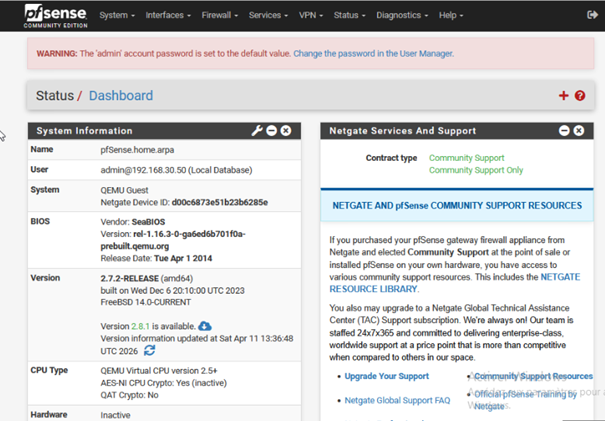

- Windows Server (Active Directory, DNS, DHCP)

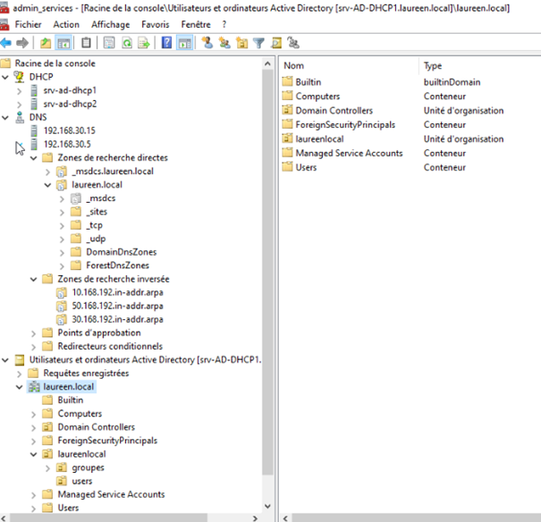

- Linux (Debian)

- GLPI

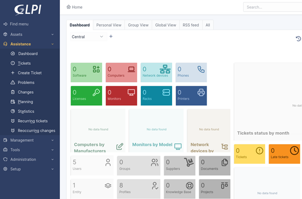

- Zabbix

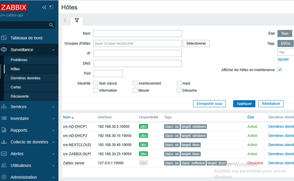

- Nextcloud

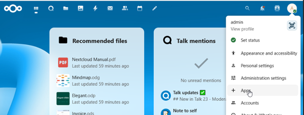

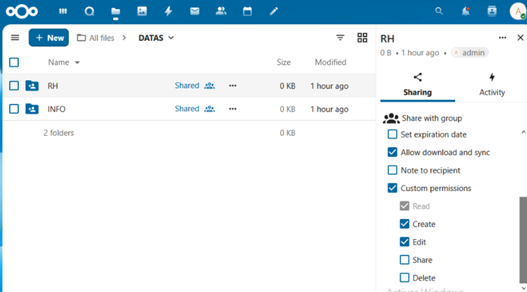

- Sauvegarde avec VEEAM BACKUP

## Mise en place

### Réseau
- Configuration pfSense
- Routage et relais DHCP

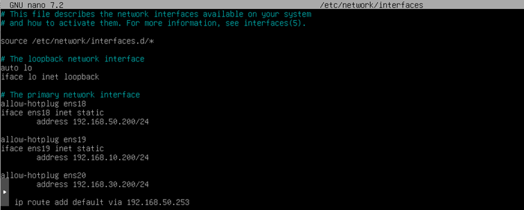

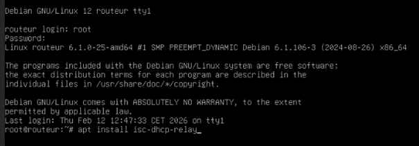

### Active Directory
- Création domaine
  

- AD primaire + secondaire (redondance)
  

### Services
- GLPI
  
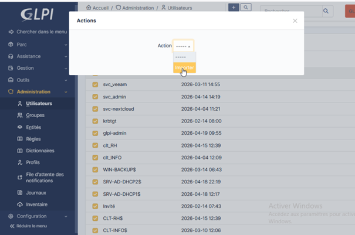

- Zabbix (supervision)

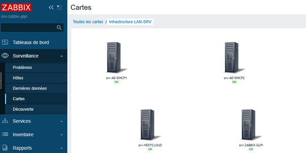

- Nextcloud (avec LDAP)

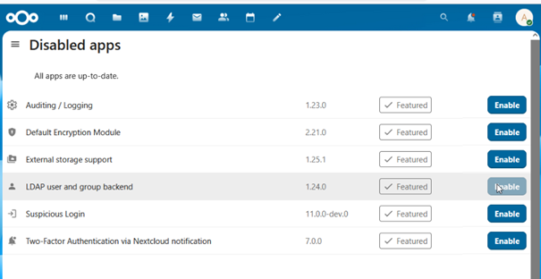

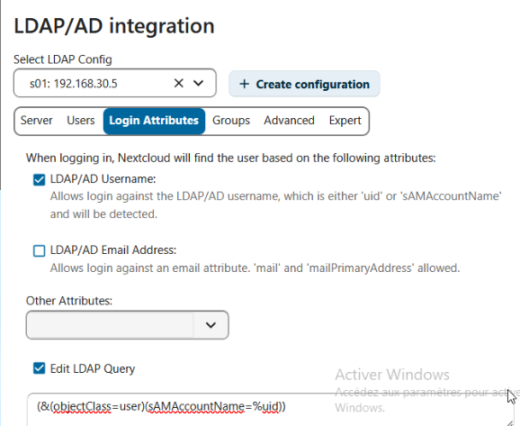

- VPN IPsec

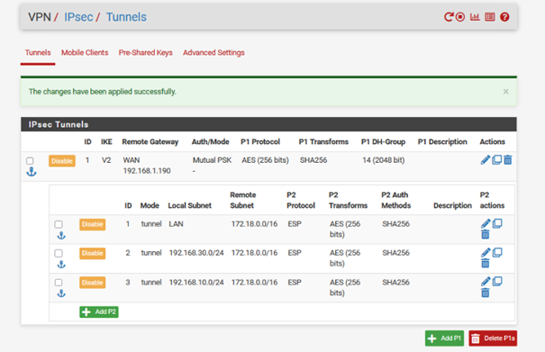

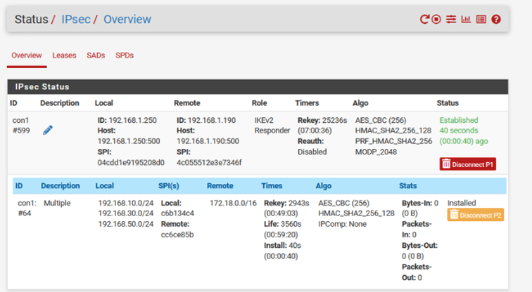

### Sécurité
- HTTPS

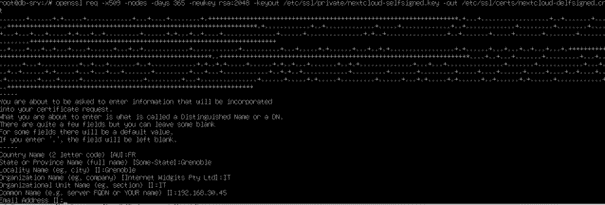

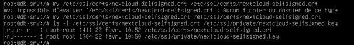

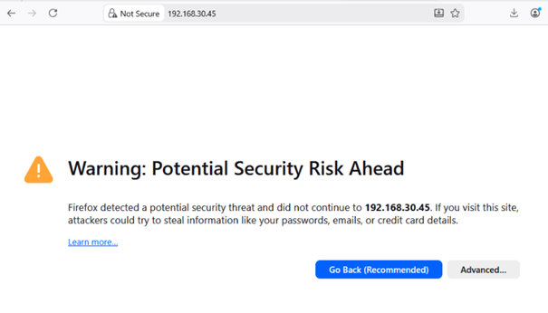

- VPN Nomade

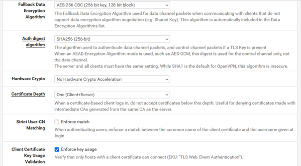

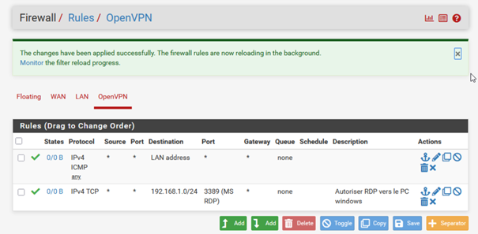

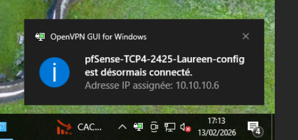

- VPN IPSEC

## Outils d'administration Windows
- Console mmc.exe

## Outils de connexion à distance
- MRemoteNG

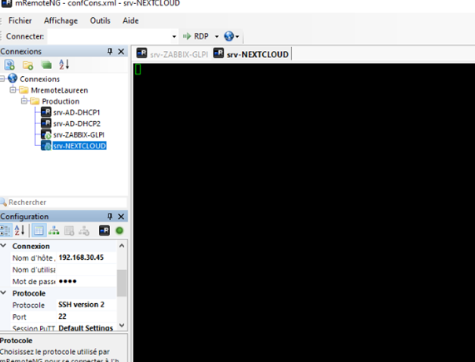

- WinSCP

## Résultat
Infrastructure complète fonctionnelle avec supervision et sécurisation.

## Compétences
- Administration systèmes Windows/Linux
- Réseaux
- Cybersécurité
- Supervision
