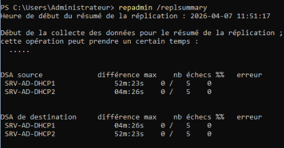

# infrastructure-entreprise-bts

## Objectif
Réalisation d’une infrastructure d’entreprise dans le cadre de mon BTS SIO SISR.

## Technologies utilisées
- pfSense (firewall, NAT, VPN)
- Windows Server (Active Directory, DNS, DHCP)
- Linux (Debian)
- GLPI

  

### Services
- GLPI
- Zabbix (supervision)
- Nextcloud (avec LDAP)

### Sécurité
- HTTPS
- VPN Nomade

## Outils d'administration Windows
- Console mmc.exe

## Outils de connexion à distance
- MRemoteNG
- WinSCP

## Résultat
Infrastructure complète fonctionnelle avec supervision et sécurisation.

## Compétences
- Administration systèmes Windows/Linux
- Réseaux
- Cybersécurité
- Supervision
