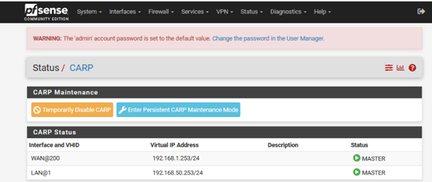
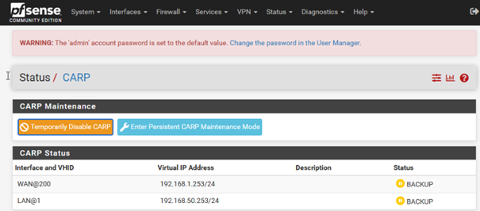

# Conception d’une infrastructure systèmes & réseaux d’entreprise (Projet BTS)
 
## Objectif

Réalisation d’une infrastructure d’entreprise dans le cadre de mon BTS SIO SISR.

## Technologies utilisées

- pfSense (firewall, NAT, VPN)
- Windows Server (Active Directory, DNS, DHCP)
- Linux (Debian)
- GLPI
- Zabbix
- Nextcloud
- VPN

## Mise en place

### Réseau 

- PfSense

Utilisation d'un logiciel open source de sécurité réseau qui transforme un ordinateur en pare-feu sophistiqué

Règles

Haute disponibilité (CARP)

 

Routage
  

Relais DHCP

Installation d'un périphérique qui transfère les paquets DHCP entre les clients DHCP et les serveurs DHCP entre différents sous-réseaux

### Active Directory

Gestion centralisée des utilisateurs et des ressources avec redondance.

#### Création domaine
  

#### AD primaire + secondaire (redondance)
  

### Services

- GLPI
- Zabbix (supervision)
  

- Nextcloud (avec LDAP)

Mise en place d'un environnement de travail collaboratif 

- Sauvegarde (avec VEEAM BACKUP)

Veeam Backup & Replication est le moteur de sauvegarde et restauration de Veeam Data Platform

# Sécurité

## HTTPS

## VPN

- VPN IPsec

Mise en place d'une solution permettant la connexion sécurisée entre deux sites distants 

- VPN Nomade

Mise en place d'une solution garantissant des accès sécurisés à un
service, internes au périmètre de sécurité de
l'organisation

## Système d'exploitation utilisés 

- Windows Server Core (Active Directory, DNS, DHCP)

La version Server Core de Microsoft sans interface graphique, conçue pour les environnements d'entreprise critiques nécessitant des performances et une sécurité renforcée.

- Linux (Debian)

- Windows client

## Outils d'administration centralisée Windows

### Console mmc.exe

Utilisation d'un gestionnaire de console virtuelle incorporée dans Microsoft Windows 

## Outils de connexion à distance

### MRemoteNG

Utilisation d'un outil pour administrer et centraliser les serveurs via RDP, SSH, VNC, etc

### WinSCP

Utilisation de transfert de fichiers entre un ordinateur local et un serveur distant 

# Résultat

Infrastructure complète fonctionnelle avec supervision et sécurisation.

# Compétences

- Administration systèmes Windows/Linux
- Réseaux
- Cybersécurité
- Supervision
