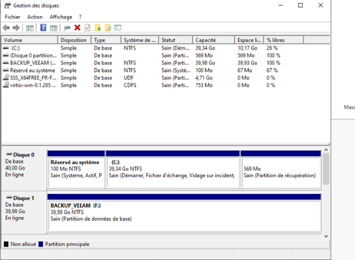
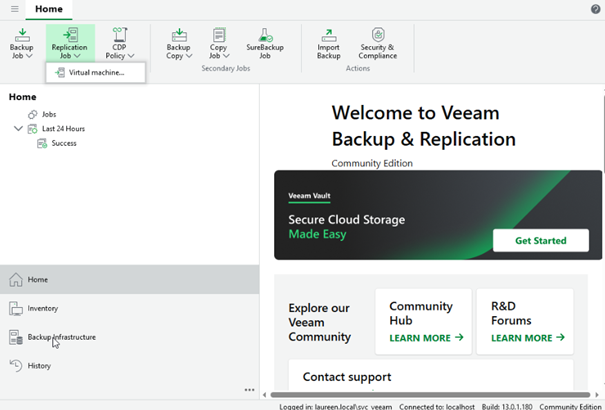
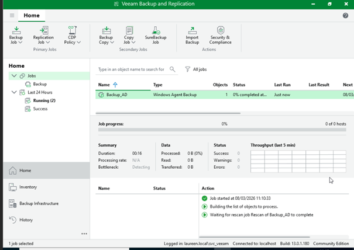
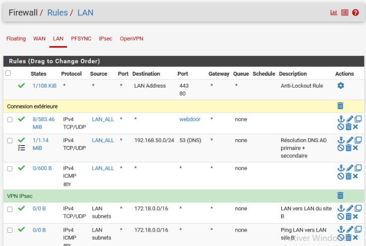
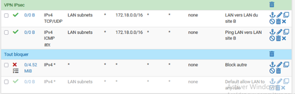
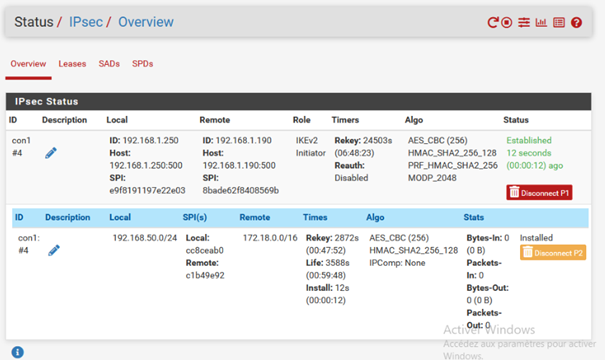
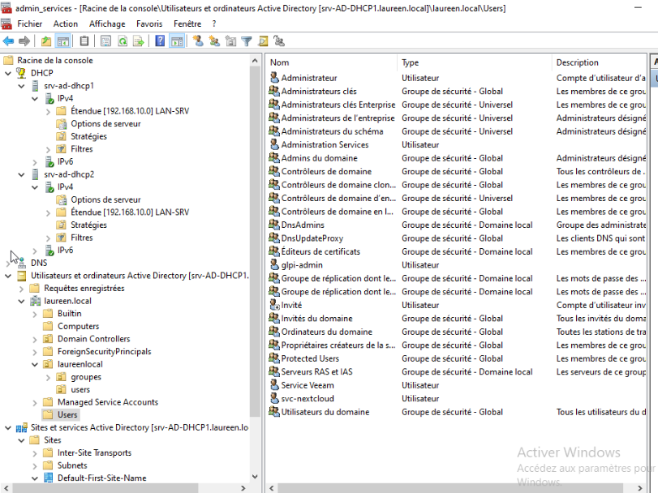
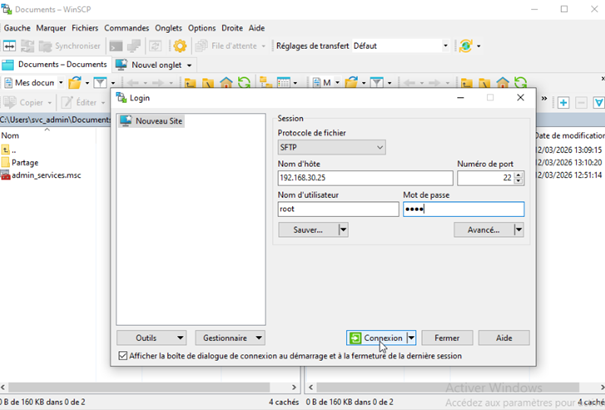
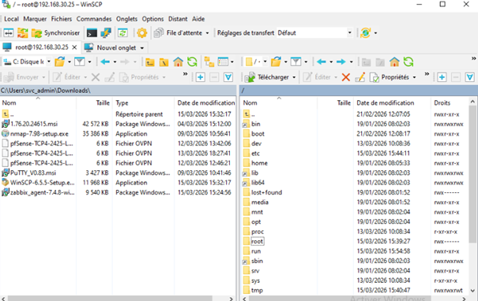

# Conception d’une infrastructure systèmes & réseaux d’entreprise (Projet BTS)
 
# Objectif

Réalisation d’une infrastructure d’entreprise dans le cadre de mon BTS SIO SISR.

# Technologies utilisées

## PfSense

Utilisation d'un logiciel open source de sécurité réseau qui transforme un ordinateur en pare-feu sophistiqué

### Tableau de bord

## Windows Server Core (Active Directory, DNS, DHCP)

La version Server Core de Microsoft sans interface graphique, conçue pour les environnements d'entreprise critiques nécessitant des performances et une sécurité renforcée.

## Linux (Debian)

### Configuration routeur

# Mise en place 

## Serveurs

### GLPI

### Zabbix

### Nextcloud

## Sauvegarde 

Veeam Backup & Replication est le moteur de sauvegarde et restauration de Veeam Data Platform

### VEEAM BACKUP

## Réseau

Infrastructure réseau sécurisée avec filtrage et routage fonctionnel.

### Configuration pfSense

- Règles

- Haute disponibilité (CARP)
  
### Installation relais DHCP

Installation d'un périphérique qui transfère les paquets DHCP entre les clients DHCP et les serveurs DHCP entre différents sous-réseaux

### Active Directory

Gestion centralisée des utilisateurs et des ressources avec redondance.

#### Création domaine
  

#### AD primaire + secondaire (redondance)
  

# Services

Déploiement et sécurisation d'une plateforme de supervision et de gestion de parc informatique avec mise en conformité HTTPS

## GLPI
  

## Zabbix (supervision)

## Nextcloud (avec LDAP)

Mise en place d'un environnement de travail collaboratif 

## VPN IPsec

Mise en place d'une solution permettant la connexion sécurisée entre deux sites distants 

# Sécurité

## HTTPS

## VPN Nomade

Mise en place d'une solution garantissant des accès sécurisés à un
service, internes au périmètre de sécurité de
l'organisation

## VPN IPSEC

# Outils d'administration Windows

### Console mmc.exe

Utilisation d'un gestionnaire de console virtuelle incorporée dans Microsoft Windows 

## Outils de connexion à distance

### MRemoteNG

Utilisation d'un outil pour administrer et centraliser les serveurs via RDP, SSH, VNC, etc

### WinSCP

Utilisation de transfert de fichiers entre un ordinateur local et un serveur distant 

# Résultat

Infrastructure complète fonctionnelle avec supervision et sécurisation.

# Compétences

- Administration systèmes Windows/Linux
- Réseaux
- Cybersécurité
- Supervision
